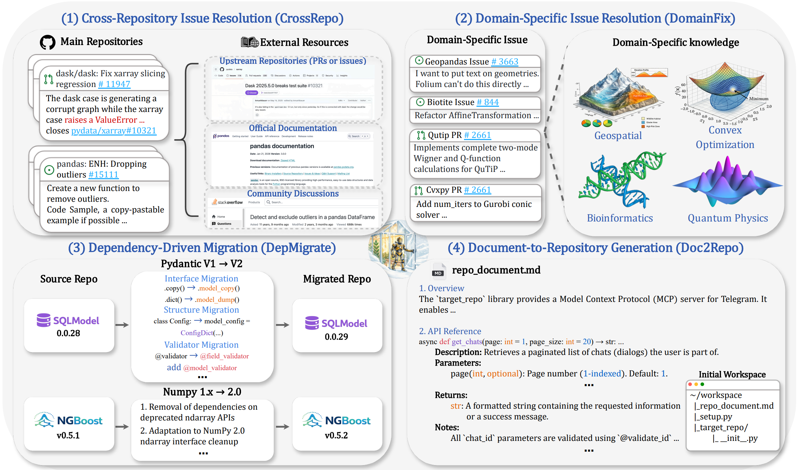
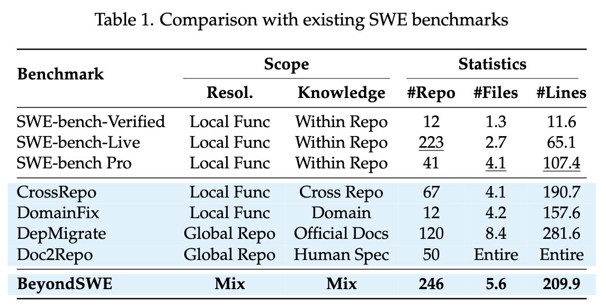
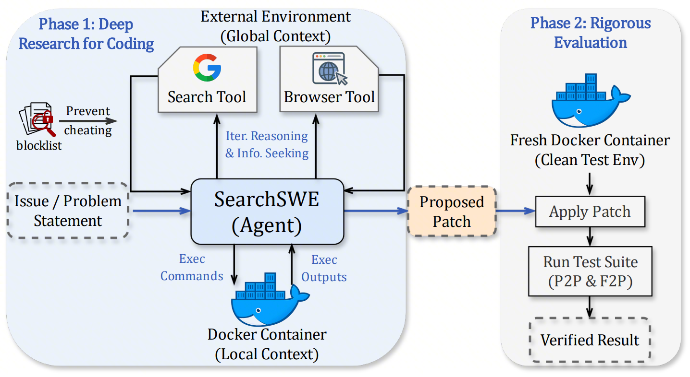
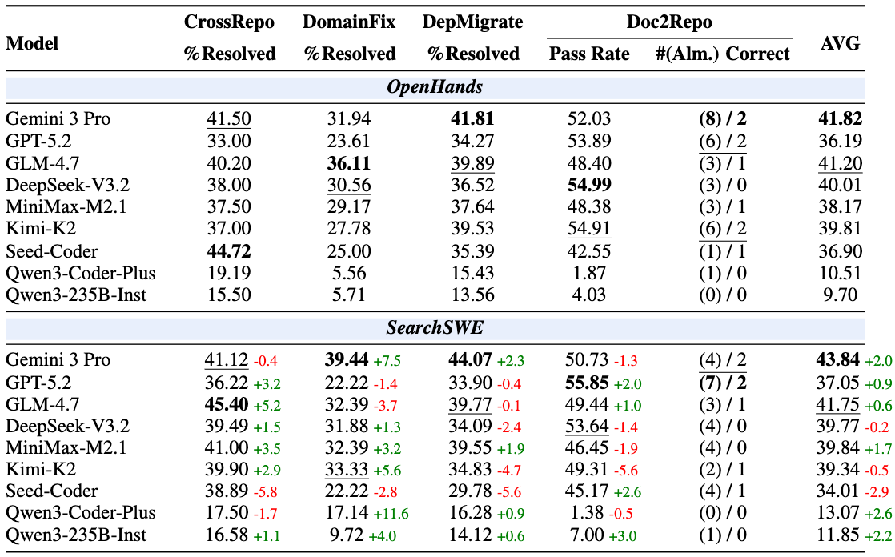

<div align="center">

# BeyondSWE: Can Current Code Agent Survive Beyond Single-Repo Bug Fixing?

[](http://arxiv.org/abs/2603.03194)
[](https://huggingface.co/datasets/AweAI-Team/BeyondSWE)
[](https://github.com/AweAI-Team/AweAgent)
[](https://aweai-team.github.io/BeyondSWE/)
[](LICENSE)

</div>

<p align="center">
  
</p>

> **BeyondSWE** evaluates code agents along two key dimensions — **resolution scope** and **knowledge scope** — moving beyond single-repo bug fixing into the real-world deep waters of software engineering.
>
> We also introduce **[SearchSWE](https://github.com/AweAI-Team/AweAgent)**, a framework that integrates deep research capabilities with coding agents.

## 📑 Table of Contents

- [✨ Highlights](#-highlights)
- [📋 Benchmark Overview](#-benchmark-overview)
- [🔍 SearchSWE Framework](#-searchswe-framework)
- [📈 Results](#-results)
- [🚀 Quick Start](#-quick-start)
- [📝 Citation](#-citation)
- [📄 License](#-license)

---

## 📰 News

- `[2026-03-01]` 🎉 BeyondSWE benchmark and SearchSWE framework released!

---

## ✨ Highlights

- 🗂️ **500 real-world instances** across **246 GitHub repositories**, spanning four distinct task settings
- 📐 **Two-dimensional evaluation** — simultaneously expands both resolution scope (local → global) and knowledge scope (within-repo → cross-repo / domain / web)
- 📊 **18x more complex** than SWE-bench Verified — 5.6 files and 209.9 lines per instance on average (vs. 1.3 files / 11.6 lines)
- 🔍 **SearchSWE framework** — first standardized benchmark for evaluating deep research in coding, with rigorous anti-cheating mechanisms
- 🔑 **Key finding** — frontier models plateau below **45%** on BeyondSWE, despite achieving 80%+ on SWE-bench Verified

---

## 📋 Benchmark Overview

BeyondSWE covers four task settings that span the full spectrum of real-world software engineering challenges:

| Task | Resolution Scope | Knowledge Scope | #Repos | #Instances | Description |
|:---|:---|:---|:---:|:---:|:---|
| **🔗 CrossRepo** | Local Function | Cross-Repository | 67 | 200 | Fix issues that require consulting external repositories, Stack Overflow, and upstream libraries |
| **🧬 DomainFix** | Local Function | Domain-Specific | 12 | 72 | Solve bugs in specialized scientific domains (quantum physics, bioinformatics, etc.) requiring expert knowledge |
| **🕊️ DepMigrate** | Global Repository | Official Docs | 120 | 178 | Perform codebase-wide migration triggered by breaking dependency upgrades (e.g., NumPy 1.x → 2.0) |
| **📝 Doc2Repo** | Global Repository | Human Spec | 50 | 50 | Build an entire functional repository from a natural language specification |

### Comparison with Existing Benchmarks

<p align="center">
  
</p>

---

## 🔍 SearchSWE Framework

<p align="center">
  
</p>

**SearchSWE** augments code agents with deep research capabilities, enabling them to interleave web search and code reasoning — just like real developers do.

**Key Components:**
- **SearchTool** — Query web search engines during task solving
- **BrowserTool** — Retrieve and summarize webpage content given a URL and goal

**Anti-Cheating Mechanisms:**
- Regex-based blocklist filters both search results and bash commands, blocking any access to the target repository (GitHub/GitLab pages, API endpoints, raw content sources, git operations)
- Docker environments are sanitized by removing all commits after the target commit

> For the SearchSWE agent implementation, see [**AweAgent**](https://github.com/AweAI-Team/AweAgent).

---

## 📈 Results

<p align="center">
  
</p>

### Key Findings

**1. The 45% Ceiling** — Even frontier models (Gemini 3 Pro, GPT-5.2, DeepSeek-V3.2, etc.) fail to exceed 45% overall on BeyondSWE, compared to 80%+ on SWE-bench Verified.

**2. No Single Winner** — Different models lead on different tasks — Seed-Coder on CrossRepo (44.72%), DeepSeek-V3.2 on Doc2Repo (54.99%), Gemini 3 Pro on DepMigrate (41.81%) — revealing that the four tasks test fundamentally different capabilities.

**3. Search Helps, but Integration Remains Open** — 6 out of 9 models improve with SearchSWE, with Gemini 3 Pro gaining +7.5% on DomainFix. However, gains are inconsistent — search and coding have matured independently, but their effective fusion is still an unsolved challenge.

**4. Quality over Quantity** — Gemini 3 Pro searches only 0.8–1.1 times per instance yet achieves the best overall gain (+2.0%), while DeepSeek-V3.2 searches 4.2–5.4 times but shows a slight decline (-0.2%).

---

## 🚀 Quick Start

<!-- ### Installation

```bash
git clone https://github.com/AweAI-Team/BeyondSWE.git
cd BeyondSWE
``` -->

### Data

The benchmark data is available on Hugging Face:

```python
from datasets import load_dataset

dataset = load_dataset("AweAI-Team/BeyondSWE")
```

### Evaluation with SearchSWE

Please refer to [**AweAgent**](https://github.com/AweAI-Team/AweAgent) for the full evaluation pipeline, including SearchSWE setup and running instructions.

---

## 📝 Citation

If you find BeyondSWE useful in your research, please cite our paper:

```bibtex
@article{beyondswe2026,
  title={BeyondSWE: Can Current Code Agent Survive Beyond Single-Repo Bug Fixing?},
  author={Guoxin Chen and Fanzhe Meng and Jiale Zhao and Minghao Li and Daixuan Cheng and Huatong Song and Jie Chen and Yuzhi Lin and Hui Chen and Xin Zhao and Ruihua Song and Chang Liu and Cheng Chen and Kai Jia and Ji-Rong Wen},
  year={2026}
}
```

---

## 📄 License

This project is licensed under the CC BY 4.0 License — see the [LICENSE](LICENSE) file for details.

---

<div align="center">

**If you find this project useful, please consider giving it a ⭐ !**

</div>
